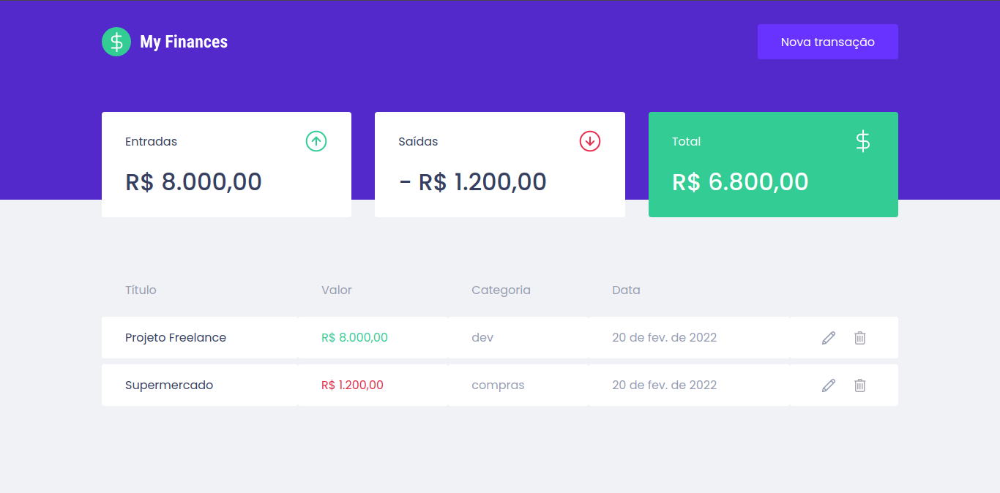

<h1 align="center">
  💰 My Finances
</h1>
<h3 align="center">
  🚀 Ignite | Trilha ReactJS
</h3>

<p align="center">
  <a href="https://www.rocketseat.com.br/" target="_blank">
    
  </a>

   

  

  <a href="https://app.rocketseat.com.br/me/goncadanilo">
    
  </a>
</p>

<p align="center">
  <a href="#-tecnologias">Tecnologias</a>&nbsp;&nbsp;&nbsp;|&nbsp;&nbsp;&nbsp;
  <a href="#-projeto">Projeto</a>&nbsp;&nbsp;&nbsp;|&nbsp;&nbsp;&nbsp;
  <a href="#-como-rodar">Como rodar</a>&nbsp;&nbsp;&nbsp;|&nbsp;&nbsp;&nbsp;
  <a href="#-licença">Licença</a>
</p>

<br>

<p align="center">
  
</p>

## 🚀 Tecnologias

Esse projeto foi desenvolvido com as seguintes tecnologias:

- [React JS](https://pt-br.reactjs.org/)
- [TypeScript](https://www.typescriptlang.org/)
- [Styled Components](https://www.styled-components.com/)
- [Mirage JS](https://miragejs.com/)
- [Axios](https://axios-http.com/docs/intro)
- [Yup](https://github.com/jquense/yup)

## 💻 Projeto

Esse projeto é um sistema de controle financeiro que calcula o valor total de gastos e receitas de um determinado período.

Nesse módulo aprendi como construir uma aplicação front-end web completa utilizando conceitos e ferramentas importantes do ecossistema React como Styled Components, MirageJS, Context API, hooks, Axios e muito mais.

Veja o resultado do projeto [aqui](https://my-finances-app.netlify.app/).

## 🔧 Como rodar

É necessário ter instalado:
- [Git](https://git-scm.com)
- [Node.js](https://nodejs.org/)
- [Yarn](https://yarnpkg.com/)

### 🗂 Faça um clone do projeto

```bash
$ git clone https://github.com/goncadanilo/my-finances.git
```

### 📥 Instale as dependências
```bash
# Acesse o diretório do projeto
$ cd my-finances

# Instale as dependências
$ yarn
```

### ⚡ Inicie a aplicação
```bash
$ yarn start
```

## 📝 Licença

Esse projeto está sob a licença MIT. Veja o arquivo [LICENSE](LICENSE) para mais detalhes.

---

Feito com ♥ by [Danilo Gonçalves](https://github.com/goncadanilo). Me adicione no [LinkedIn](https://www.linkedin.com/in/goncadanilo/) :wave:
